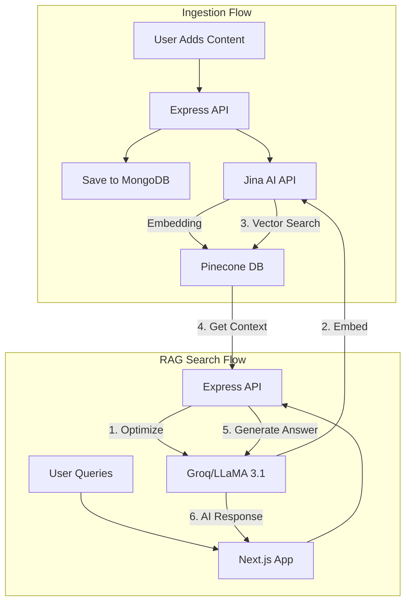

# 🧠 Second2ndBrain -> RAG based AI-Powered Content Retrieval and Sharing App

<div align="center">
  <h1>🧠 Sec2ndBrain</h1>
  <p><b>Your personal, AI-powered RAG knowledge base.</b><br/>
  <i>(Built with Next.js, Pinecone, Jina AI, and LLaMA 3.1)</i></p>

  
  
  
  
  
  
</div>

---

## 🚀 Overview

**Sec2ndBrain** isn't just a note-taking app — it's an **intelligent retrieval-augmented generation (RAG)** platform for your personal data.
It allows you to **save notes, YouTube videos, and Twitter posts**, and then **chat with your knowledge base**.

It uses:

- **Jina AI** → Create high-fidelity embeddings
- **Pinecone** → High-speed vector search
- **Groq (via LLaMA 3.1)** → Query optimization & human-like response generation

This end-to-end **TypeScript** project demonstrates a scalable, modern AI stack.

> 💡 _(Insert your app demo GIF below — essential for portfolio/showcases)_ > 

---

## ✨ Key Features

- 🧠 **AI-Powered RAG Search:** Chat directly with your data. Fetches context from your personal content for accurate, sourced answers.
- 🚀 **Query Optimization:** LLaMA 3.1 refines user queries before search (e.g., `"find js video"` → `"show videos related to JavaScript tutorials"`).
- 💾 **Unified Content Management:** Manage notes, YouTube links, or Twitter posts — all in one place.
- ☁️ **Cloud Media Storage:** Profile photo uploads & CDN delivery with Cloudinary.
- 🔐 **Secure Auth & Sharing:**

  - JWT-based auth (httpOnly cookies)
  - Shareable profile links
  - Instant revocation

- 🛡️ **End-to-End Type Safety:** 100% TypeScript — scalable, maintainable, and reliable.

---

## 🌇 System Architecture & Tech Stack

| Layer              | Technology             | Purpose                                     |
| ------------------ | ---------------------- | ------------------------------------------- |
| **Frontend**       | Next.js + TypeScript   | Client-side rendering, routing, and UI      |
| **Backend**        | Node.js + Express      | REST API, business logic, and orchestration |
| **Database**       | MongoDB                | Store user and content data                 |
| **Authentication** | JWT (httpOnly Cookies) | Secure, stateless auth                      |
| **File Storage**   | Cloudinary             | Profile photo uploads & CDN                 |
| **Vector DB**      | Pinecone               | Store and query text embeddings             |
| **Embeddings**     | Jina AI                | Generate semantic embeddings                |
| **LLM**            | LLaMA 3.1 (Groq)       | Query optimization and response generation  |

---

## 🔀 RAG & Data Flow



---

## ⚙️ How It Works: The RAG Pipeline

### 1. Content Ingestion & Embedding

When a user adds content, it's processed in two parallel paths:

- **MongoDB:** Raw text/link saved as primary record
- **Pinecone:** Embedded using Jina AI → stored under the user’s namespace

```ts
// 1. Store in MongoDB
const content = await Content.create({ userId, text: "..." });

// 2. Embed with Jina
const embedding = await jina.embedText(content.text);

// 3. Upsert vector into user's namespace
await pinecone.upsert({
  namespace: userId,
  vectors: [
    {
      id: content._id,
      values: embedding,
      metadata: { text: content.text, type: content.type },
    },
  ],
});
```

---

### 2. Semantic Search (RAG)

The RAG process unfolds as:

1. **Optimize Query** → LLaMA 3.1 rephrases search
2. **Embed Query** → Jina AI converts to vector
3. **Retrieve Context** → Pinecone finds top-K matches
4. **Generate Answer** → LLaMA 3.1 synthesizes final output

```ts
// 1. Optimize query
const optimizedQuery = await groq.optimize(searchQuery);

// 2. Embed query
const queryEmbedding = await jina.embedText(optimizedQuery);

// 3. Retrieve context
const results = await pinecone.query({
  namespace: userId,
  vector: queryEmbedding,
  topK: 5,
  includeMetadata: true,
});

// 4. Generate answer
const context = results.matches.map((r) => r.metadata.text).join("\n");
const aiResponse = await groq.generate(
  `Using this context:\n${context}\n\nAnswer the user's question: ${searchQuery}`
);
```

---

## 🚀 Getting Started

Follow these steps to set up the project locally.

### **Prerequisites**

- Node.js (v18+)
- MongoDB Atlas account
- Pinecone account
- Cloudinary account
- API keys for Jina AI and Groq

---

### **Installation & Setup**

```bash
# Clone the repository
git clone https://github.com/your-username/sec2ndbrain.git
cd sec2ndbrain

# Install root dependencies
npm install

# Install client dependencies
cd client
npm install

# Install server dependencies
cd ../server
npm install
```

---

### **Environment Variables**

Create a `.env` file inside `/server` and fill in values based on `.env.example`:

```bash
# MongoDB
MONGO_URI=your_mongodb_connection_string

# Authentication
JWT_SECRET=your_super_secret_jwt_key

# Cloudinary
CLOUDINARY_CLOUD_NAME=your_cloud_name
CLOUDINARY_API_KEY=your_api_key
CLOUDINARY_API_SECRET=your_api_secret

# AI Services
PINECONE_API_KEY=your_pinecone_key
JINA_API_KEY=your_jina_api_key
GROQ_API_KEY=your_groq_api_key
```

---

### **Run the Application**

```bash
# Start backend (from /server)
npm run dev

# Start frontend (from /client)
npm run dev
```

---

## 🔮 Future Roadmap

- [ ] **Multi-modal Embeddings:** Add support for images (screenshots, diagrams, etc.)
- [ ] **Chat Interface:** Transform search bar into persistent chat
- [ ] **Auto-Summarization:** Summarize long texts or YouTube videos
- [ ] **Content Analytics:** Dashboard for most-searched or top topics
- [ ] **Team Workspaces:** Shared Pinecone namespaces for collaboration

---

## 💡 Author

**Developed by:** [Prateek Singh](https://github.com/PRAteek-singHWY)

---

## 🧾 License

This project is licensed under the **MIT License**.
